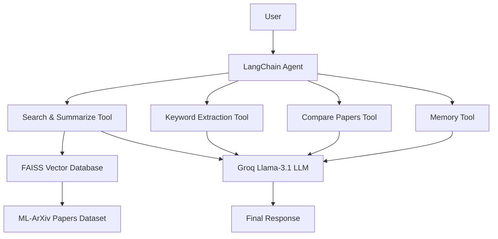
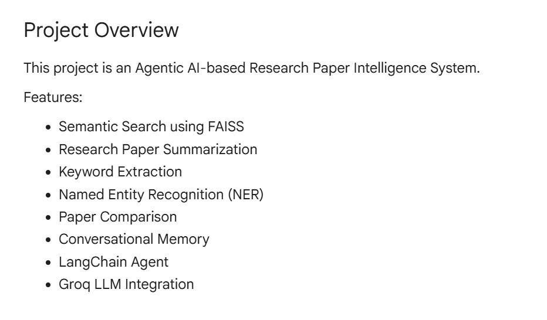
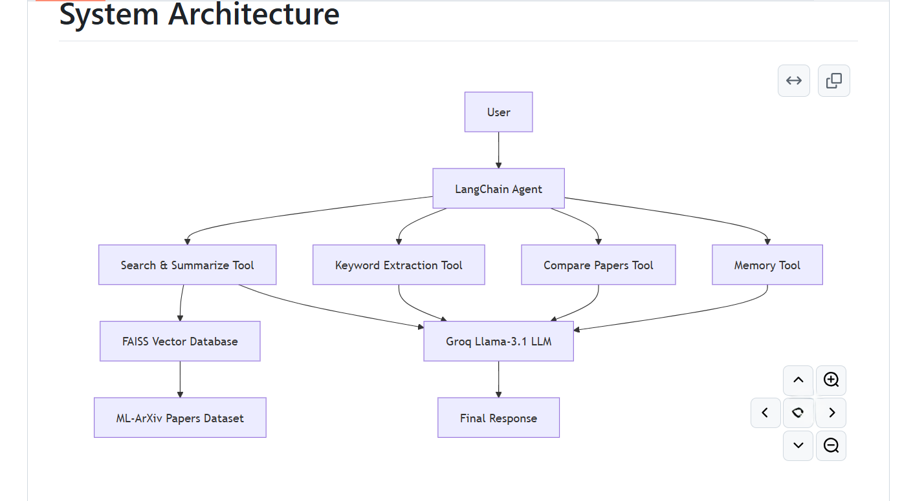
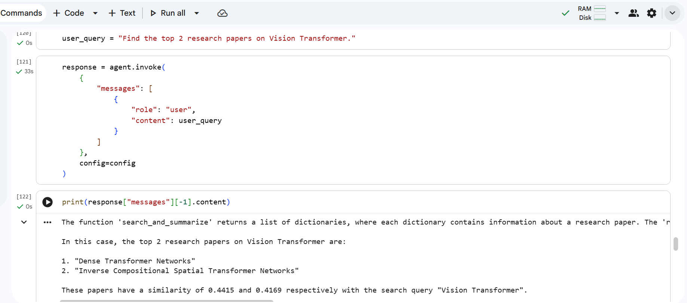
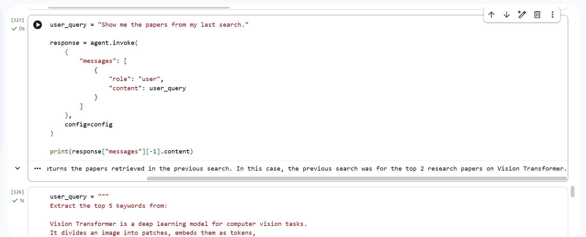
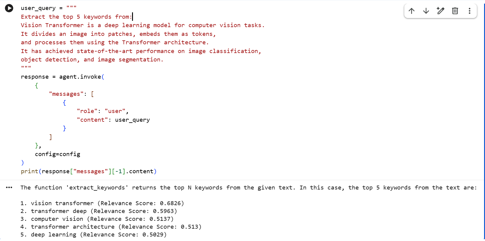
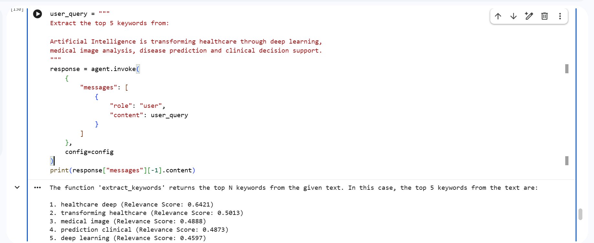

# Research Paper Intelligence System using Agentic AI
### Semantic Search • LangChain Agent • FAISS • Groq LLM • Memory • Research Paper Analysis

---
# Project Overview
This project is an **Agentic AI-powered Research Paper Intelligence System** designed to help users discover, analyze, and understand research papers efficiently using Large Language Models (LLMs), semantic search, and intelligent tool orchestration.

Unlike traditional search systems, this project uses **LangChain Agents** to automatically decide which tool to use based on the user's query. It combines semantic search, summarization, keyword extraction, paper comparison, and conversational memory into a single intelligent research assistant.

The system integrates **Sentence Transformers**, **FAISS**, **Groq Llama-3.1**, **LangChain**, and **Hugging Face models** to provide accurate and context-aware responses.

---

# Problem Statement

The number of research papers published every year is growing rapidly, making it difficult for students and researchers to find relevant papers quickly.

Traditional keyword-based search systems often fail to understand the semantic meaning of user queries, resulting in irrelevant search results.

## Key Challenges

- Difficulty finding relevant research papers
- Keyword-based search lacks semantic understanding
- Time-consuming manual reading of long abstracts
- No intelligent paper comparison
- No conversational interaction with the system

---

# Objectives

The primary objectives of this project are:

- Retrieve research papers using semantic similarity instead of keyword matching
- Build an intelligent LangChain Agent capable of selecting tools automatically
- Generate concise summaries of research papers
- Extract meaningful keywords using NLP
- Compare research papers intelligently
- Maintain conversation memory for follow-up questions
- Improve the overall research paper exploration experience

---

# Dataset

This project uses the **ML-ArXiv Papers Dataset** available on Hugging Face.

Each record contains:

- Research Paper Title
- Research Paper Abstract

The dataset is used for:

- Semantic Search
- Vector Embedding Generation
- Research Paper Retrieval
- Summarization
- Keyword Extraction

**Dataset:** <https://huggingface.co/datasets/CShorten/ML-ArXiv-Papers>

---
# Features Implemented

## 1. Dataset Loading
- Loaded the ML-ArXiv Papers Dataset from Hugging Face.
- Extracted research paper titles and abstracts.

## 2. Data Preprocessing
- Selected the required columns.
- Combined title and abstract into a single text field.
- Cleaned unwanted spaces and newline characters.
- Prepared data for embedding generation.

## 3. Embedding Generation
- Used Sentence Transformers (**all-MiniLM-L6-v2**).
- Converted research papers into dense vector embeddings.
- Represented semantic meaning numerically.

## 4. FAISS Vector Database
- Built a FAISS vector index.
- Stored research paper embeddings for efficient semantic similarity search.

## 5. Semantic Search
- Accepted user queries.
- Converted queries into embeddings.
- Retrieved the Top-K most relevant research papers.
- Displayed similarity scores.

## 6. Research Paper Summarization
- Used **Facebook BART** for abstractive summarization.
- Generated concise summaries of retrieved research papers.

## 7. Keyword Extraction
- Used **KeyBERT** to extract important keywords and key phrases.
- Identified the most relevant concepts from research paper titles and abstracts.

## 8. Named Entity Recognition (NER)
- Implemented Hugging Face's NER pipeline.
- Detected:
  - Organizations
  - Research Models
  - Frameworks
  - Universities
  - Technologies

## 9. Large Language Model (LLM) Integration
- Configured **Groq Llama-3.1-8B-Instant**.
- Integrated the LLM for intelligent reasoning and natural language responses.

## 10. Conversation Memory
- Implemented **MemorySaver** using LangGraph.
- Enabled the system to remember previous searches.
- Supported follow-up questions such as:
  - *Show my last search.*

## 11. LangChain Tools
Implemented custom tools including:

- Search and Summarize Research Papers
- Keyword Extraction
- Research Paper Comparison
- Last Search Memory Retrieval

## 12. LangChain Agent
- Built an intelligent Agentic AI system using LangChain.
- Automatically selected the appropriate tool based on user queries.
- Combined LLM reasoning with external tools.

## 13. Agent Testing
Tested the complete system using different types of queries:

- Semantic Search
- Keyword Extraction
- Research Paper Comparison
- Conversation Memory
- General LLM Interaction
  
# System Workflow

```
Load Dataset
      ↓
Preprocess Papers
      ↓
Generate Embeddings
      ↓
Create FAISS Index
      ↓
Receive User Query
      ↓
LangChain Agent
      ↓
Select Appropriate Tool
      ↓
Execute Tool
      ↓
Groq LLM
      ↓
Final Response
```

---

# System Architecture



# Technologies Used

- Python
- LangChain
- LangGraph
- Groq API
- Sentence Transformers
- FAISS
- Hugging Face Transformers
- Facebook BART
- KeyBERT
- Pandas
- NumPy
- Google Colab

---

# Project Structure

```
Research-Paper-Intelligence-System-AgenticAI
│
├── Research_Paper_Intelligence_System_AgenticAI.ipynb
├── README.md
├── requirements.txt
├── .gitignore
└── screenshots/
```

---

# Note

- FAISS index and embeddings are **not uploaded** to GitHub.
- They are generated automatically when the notebook is executed.
- This keeps the repository lightweight.

---

# Example Queries

### Semantic Search

```
Find the top 2 research papers on Vision Transformer.
```

### Keyword Extraction

```
Extract the top 5 keywords from Vision Transformer.
```

### Memory

```
Show my last search.
```

---

# Project Demonstration

## Project Overview



---

## System Architecture



---

## Semantic Search – Vision Transformer



---

## Conversation Memory



---

## Keyword Extraction – Vision Transformer



---

## Keyword Extraction – AI in Healthcare



---

# Future Scope

- Streamlit Web Application
- PDF Upload Support
- Multi-document Question Answering
- Citation Generation
- Research Recommendation Engine
- Multi-Agent Architecture
- Cloud Deployment

---

# Conclusion

This project demonstrates how Agentic AI can simplify research paper discovery using semantic search, intelligent tool selection, and Large Language Models.

By integrating LangChain Agents, FAISS, Groq LLM, and Hugging Face models, the system provides an intelligent research assistant capable of retrieving, summarizing, comparing, and analyzing research papers while maintaining conversational memory.

---

# Key Learnings

- Agentic AI
- LangChain Agents
- LangGraph
- Tool Calling
- Semantic Search
- Sentence Embeddings
- FAISS Vector Database
- Research Paper Summarization
- Keyword Extraction
- Named Entity Recognition
- Conversational Memory
- Groq LLM Integration

---

# Author

**Nisha Sharma**

**B.Tech Computer Science Engineering (AI & ML)**

### Interested in

- Artificial Intelligence
- Machine Learning
- Natural Language Processing
- Agentic AI
- Data Analytics

---

# Acknowledgement

This project was developed as part of my learning in **Agentic AI**, **Natural Language Processing**, and **Large Language Models**. It helped me gain practical experience in semantic search, vector databases, LangChain Agents, conversational memory, and intelligent tool orchestration while building an end-to-end AI-powered research paper intelligence system.
